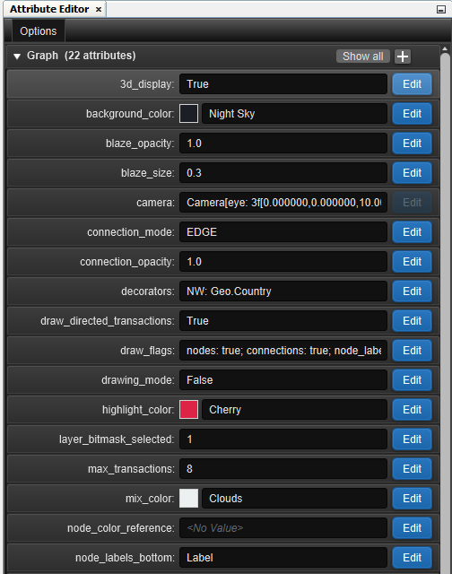

# Attribute Editor

<table data-border="1">
<caption>Attribute Editor Actions</caption>
<thead>
<tr class="header">
<th scope="col"><strong>CONSTELLATION Action</strong></th>
<th scope="col"><strong>Keyboard Shortcut</strong></th>
<th scope="col"><strong>User Action</strong></th>
<th style="text-align: center;" scope="col"><strong>Menu Icon</strong></th>
</tr>
</thead>
<tbody>
<tr class="odd">
<td>Open Attribute Editor</td>
<td>Ctrl + Shift + E</td>
<td>Views -&gt; Attribute Editor</td>
<td style="text-align: center;"></td>
</tr>
</tbody>
</table>

Attribute Editor Actions

## Introduction

The Attribute Editor is the view where you can view, add, and edit
Graph, Node, and Transaction attributes on your graph. When you have a
graph element (node or transaction) selected, you are able to view all
the current values assigned to that particular graph element. If no
value is assigned to an attribute for a given graph element, the text
"&lt;No Value&gt;" will be displayed. If more than one value is assigned
to a set of selected graph elements, the text "&lt;Multiple Values&gt;"
will be displayed and the attribute will become a drop-down list which
when expanded displays all the values assigned to that attribute (this
won't occur if only one graph element selected).

There are four different kinds of attributes you can see in the
Attribute Editor:

-   *Schema Attributes* - These are regular old attributes which
    CONSTELLATION has defined in a schema. They have a black background
    by default.
-   *Primary Key Attributes* - These are important attributes that
    define a graph element. The set of primary key attribute values are
    unique to each graph element. They have a red background by default.
-   *Custom Attributes* - These are attributes which are not defined in
    a CONSTELLATION schema. They have a blue background by default.
-   *Hidden Attributes* - These are attributes which have been hidden.
    You can hide an attribute by right-clicking on it and selecting
    "Hide Attribute". They have a grey background by default.

## Editing An Attribute

To edit an attribute, select the nodes and transactions you want to edit
and then click on the 
button. This will bring up a dialog box to change the value. Once you
have finished changing the value, press "Ok" to apply the change. If
more than one graph element is selected than the new value will be
applied to all the relevant selected graph elements.

NOTE: If you want to change the time zone of an attribute, right click
on the attribute say "DateTime" and select "Update time-zone of
selection" and set the time zone. This will update the time zone for for
the selected nodes/transactions only.

## Adding An Attribute

To add an attribute to your graph, click on the  button of the relevant graph
element type and choose the attribute you want to add. If you select
"Custom", you will be required to fill in all the details of the new
attribute.

## Editing Primary Key

From the Attribute Editor, you can also edit the primary key for a graph
element type (recall these are the attributes which uniquely define a
graph element). To do so, click on the  button of the relevant graph
element type and select which elements you want to be a part of the
primary key. You will only be able to choose from attributes that are
already on the graph (refer to adding an attribute if the attribute you
want to add to the primary key isn't currently on the graph).

## Autocomplete with Schema

A change made in the Attribute Editor won't be applied to the graph
until a Complete with Schema (F5) is run. By default, you will have to
perform this step manually but there is an option to have this done
automatically for you after you edit an attribute. To enable this, Click
on the "Options" menu at the top of the view and select "Complete with
Schema After Edits". With this enabled, it will run Complete with Schema
after every attribute value you edit via the Attribute Editor. Select
that same option to disable it and return to default behaviour.
