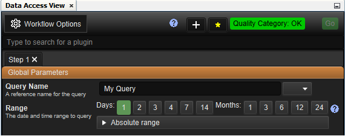

# Data Access View

<table data-border="1">
<caption>Data Access View Actions</caption>
<thead>
<tr class="header">
<th scope="col"><strong>CONSTELLATION Action</strong></th>
<th scope="col"><strong>Keyboard Shortcut</strong></th>
<th scope="col"><strong>User Action</strong></th>
<th style="text-align: center;" scope="col"><strong>Menu Icon</strong></th>
</tr>
</thead>
<tbody>
<tr class="odd">
<td>Open Data Access View</td>
<td>Ctrl + Shift + D</td>
<td>Views -&gt; Data Access View</td>
<td style="text-align: center;"></td>
</tr>
</tbody>
</table>

Data Access View Actions

## Introduction

Data Access View is the interface for interacting with CONSTELLATION
plugins that involve data. It allows users to perform queries that do
things such as import, enrich, and clean data, all from the one window.

## Running Queries

At the very top, there is a list of tabs. Pressing the  button allows steps to be added (as
tabs), and the X in the tab name will remove it. Tabs can be customised
to perform different queries, and when ready, pressing the  button will cause each tab to run
their queries sequentially. The Go button will only highlight once a
check box has been selected and a graph has been opened.

In the tab, users can enter values for the global parameters that will
apply to every query they run in that tab. The Range option allows users
to specify the time period they wish to run the query. Selecting one of
the Days or Months buttons will run the query from that many months or
days ago to the present day. Alternatively, a custom time period can be
selected by pressing custom and inputting a from and to date.

From the tabs below, users can select which queries they wish to run.
The arrows allow options to be visible or hidden. Selecting the checkbox
next to the name of the query will cause that query to run when Go is
pressed.

**NOTE:** Queries in the Data Access View typically only run on selected
nodes and transactions.

**NOTE:** When Go is pressed, the values of the parameters in Global
Parameters and any other plugins are saved as part of the graph's state
so that when you save and load the graph, the last used values are
restored.

## Global Parameters

Refer to the [Global Parameters](data-access-global-parameters.html)
page for more details on the global parameters section.

## Filtering

You can filter plugins by typing in the search bar at the top of the
view. Alternatively, you can right click anywhere on the Data Access
View and choose the "Find plugin..." option.

## Favourites

You can add plugins to your favourites category by clicking on
 which will allow
you to add or remove plugins you have selected from the favourites
category.

## Options Menu

Refer to the [Options](data-access-options.html) page for more details
on the options menu.
