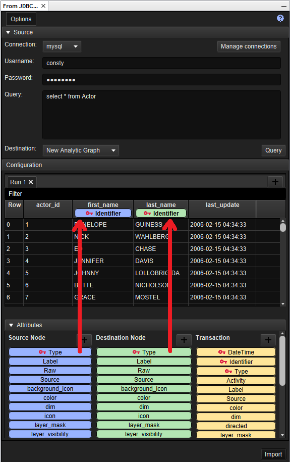

# Import from Database

The "Import from Database" window allows you to import data from a
database using a JDBC Connection.

## High level workflow steps

The following is a high level workflow an analyst can follow to get the
most out of the import from database feature:

1.  Add the relevant JDBC Driver via "Manage Connections" -&gt;
    "Drivers" tab.
2.  Add the Connection details in "Manage Connections" -&gt;
    "Connections" tab. If the "Username" and "Password" are not
    required, leave them blank.
3.  Select the connection from the "Connection" drop-down in the main
    Import window.
4.  Enter the "Username" and "Password" if the connection requires them.
5.  Enter the SQL "Query" and Click the "Query" button to retrieve data.
6.  Select your destination graph.
7.  Drag and drop attributes from the bottom pane onto your columns.
8.  Right click an attribute for more options.
9.  Click on the "Import" button to import the data to your destination
    graph.

Some useful hints are:

-   See all supported attributes using Options -&gt; Show all schema
    attributes
-   Hover over the attribute name for a tooltip.
-   Filter in the Configuration Pane by adding searches of the form
    &lt;column\_name&gt; =="&lt;search text&gt;" E.g.
    first\_name=="Nick".

Once establish a connection, the **Configuration** section will display
the first 100 rows as a preview. The limit of 100 rows is to make the
loading of the preview quick so that you can get on with the rest of the
configuration activities.

If you have multiple connections, selecting the connection will update
the preview in the **Configuration** section.

The **Initialise With Schema** is enabled by default and will be what
you want in most scenarios. With this option enabled, it will mean that
the new nodes and transactions added to the graph will follow the rules
governed my the schema. For example, if this is not selected then the
nodes imported will not have a label, icon and other attributes defined.

## Select the destination graph

Select the destination graph from the drop down list. Note that when
selecting the destination, the attributes in the configuration pane
update depending on what attributes are supported by the schema of that
graph.

## Apply Attributes to the data

Applying an attribute to the column is simple as dragging and dropping
an attribute onto a column.

By default, not all attributes available to the selected schema are
visible because there can be an overwhelming number of attributes
depending on the schema. To see all possible attributes you can apply to
a graph go to Options -&gt; Show all schema attributes.

If you have a specific format for example the DateTime, then you can
right click on the DateTime attribute and select the format from the
drop down list or enter your own.

If you want to create your own attributes then you can by clicking on
 and selecting a type and entering a label.

## Directed and undirected transactions

By default, transactions are created as directed. In the Transaction
Attributes column there is a pseudo-attribute called \_\_directed\_\_ which can be used to create
directed and undirected transactions as required. The \_\_directed\_\_ pseudo-attribute is a boolean that
will cause a transaction to be directed when its value is
(case-insensitively) "true", and undirected otherwise.

## Importing Data

Once your configuration is finished, import the entire database by
clicking on the **Import** button located at the bottom right hand
corner.

Note that the import view does not dissappear. This is so that you don't
have to re-configure from the beginning. Once you are satisfied with the
configuration, you have the ability to save your settings explained in
the next section.

## Saving and loading import templates

An import configuration can be saved as a template, and loaded at a
later time, using the "Options" menu in the top left corner of the
window.

When a template is saved, the import definition name is used to name the
saved query. If a query of that name has already been saved, you will be
asked if you want to overwrite it. Templates are saved in the directory
*HOME\_DIRECTORY*/.CONSTELLATION/ImportJDBC.
(The name of the file in which the template is saved is encoded so it
doesn't clash with file system limitations.) Files in this directory can
be deleted using your favourite file management utility.

Before loading a template, you should select the files you want to
import. The loaded template attempts to match the column names it knows
with the column names in the current files. If a template is loaded
before any files are selected, there are no columns to match against.

When you select "Load...", you will be presented with a list of saved
templates. Select one from the list and select Ok. The template will be
loaded and will appear as it was when it was saved.

## Share templates

To share the template do the following:

1.  Click on Help -&gt; User Directory
2.  Navigate to the folder called **ImportDelimited**
3.  Give the appropriate .json file to a recipient
4.  Upon receiving the file, they can follow these steps to save that
    .json file inside the **ImportDelimited** directory

Note that the .json filename should not change!
