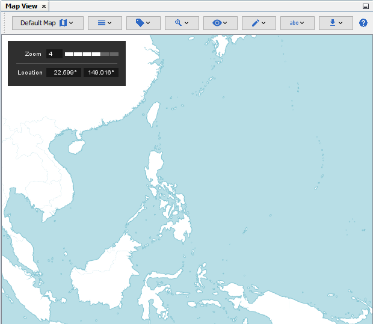

# Map View

<table data-border="1">
<caption>Map View Actions</caption>
<colgroup>
<col style="width: 25%" />
<col style="width: 25%" />
<col style="width: 25%" />
<col style="width: 25%" />
</colgroup>
<thead>
<tr class="header">
<th scope="col"><strong>CONSTELLATION Action</strong></th>
<th scope="col"><strong>Keyboard Shortcut</strong></th>
<th scope="col"><strong>User Action</strong></th>
<th scope="col"><strong>Menu Icon</strong></th>
</tr>
</thead>
<tbody>
<tr class="odd">
<td>Open Map View</td>
<td>Ctrl + Shift + M</td>
<td>Views -&gt; Map View</td>
<td>

</td>
</tr>
</tbody>
</table>

Map View Actions

## Introduction

The Map View provides a visualisation of geospatial data in a
Constellation graph as well as features for basic geospatial analysis.

## Base Maps

Base maps are provided by local or network tile servers, with the
default map being a simple built-in map consisting only of country
borders. The Map View can be extended to source its base map data from a
custom location (refer to the Developer Guide for more information on
how to do this). You can switch between available base maps using the
 menu.

## Layers

Layers can be rendered on top of the map in order to provide additional
visualisations for analytic purposes. Layers can be switched on and off
using the  menu.

## Overlays

Overlays can be rendered on top of the map in order to provide
additional information or features to the Map View. Overlays can be
switched on and off using the  menu.

## Zooming

You can zoom to markers or custom locations on the map using the  menu.

## Marker Types

The Map View is capable of rendering points, lines, polygons and
multi-polygons to represent geospatial data on a graph. By default, it
will read from the "Geo.Latitude" and "Geo.Longitude" attributes for
point data, and the "Geo.Shape" attribute for line, polygon and
multi-polygon data, where it will expect to find a GeoJSON object
representing the shape as a Feature Collection. The Map View can also
render clusters (calculated using marker centroids). All of these marker
types can be switched on and off using the  menu.

## Marker Customisation

You customise markers with colours and labels using data on the graph.
This can be achieved by selecting options in the  and  menus.

## Exporting Data

Geospatial data can be exported to a range of open data formats using
the  menu.
