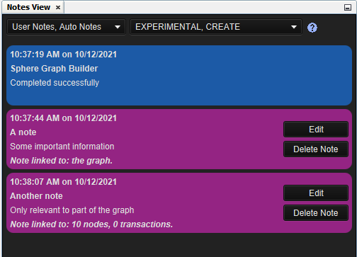

# Notes View

<table data-border="1">
<caption>Notes View Actions</caption>
<thead>
<tr class="header">
<th scope="col"><strong>CONSTELLATION Action</strong></th>
<th scope="col"><strong>Keyboard Shortcut</strong></th>
<th scope="col"><strong>User Action</strong></th>
<th style="text-align: center;" scope="col"><strong>Menu Icon</strong></th>
</tr>
</thead>
<tbody>
<tr class="odd">
<td>Open Notes View</td>
<td>Ctrl + Shift + A</td>
<td>Experimental -&gt; Views -&gt; Notes View</td>
<td style="text-align: center;"></td>
</tr>
</tbody>
</table>

Notes View Actions

## Introduction

The Notes View allows you to annotate on your graph. This is useful for
remembering important pieces of information, and keeping track of what
plugins have been run.

There are two kinds of notes that can be added to the Notes View:

## User Generated Notes

These are notes which are created by a user and are coloured red. These
notes are generated by filling the title and note fields located at the
bottom of the Notes View and pressing "Add Note". Both of these fields
need to be filled in otherwise a message will pop-up prompting you to
fill in both fields. Once added, these notes can edited by pressing the
"Edit" button on the note and deleted by pressing the "Delete" button on
the note.

## Auto Generated Notes

These are notes which are created by CONSTELLATION and are coloured
blue. These notes are generated when plugins are executed. Unlike user
generated notes, these notes cannot be edited or removed.

NOTE: Auto generated notes are always created in the background but they
won't be added to the Notes View unless the view is open. If you close
CONSTELLATION before it has a chance to add those notes to the Notes
View, those notes will be lost.
