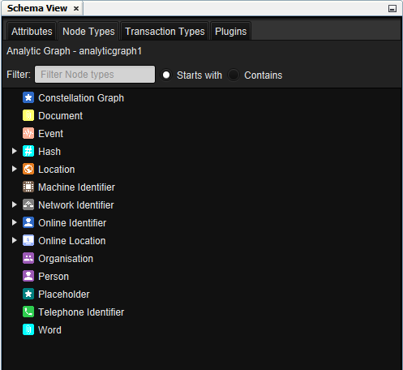

# Schema View

<table data-border="1">
<caption>Schema View Actions</caption>
<colgroup>
<col style="width: 25%" />
<col style="width: 25%" />
<col style="width: 25%" />
<col style="width: 25%" />
</colgroup>
<thead>
<tr class="header">
<th scope="col">Constellation Action</th>
<th scope="col">Keyboard Shortcut</th>
<th scope="col">User Action</th>
<th scope="col">Menu Icon</th>
</tr>
</thead>
<tbody>
<tr class="odd">
<td>Open Schema View</td>
<td>Ctrl + Shift + S</td>
<td>Views -&gt; Schema View</td>
<td>

</td>
</tr>
</tbody>
</table>

Schema View Actions

## Introduction

The Schema View is the source of information for all attributes, types,
and plugins that are available in the Constellation schema(s) of the
current graph.

## Attributes

From the Attributes tab of the Schema View, you are able to view the key
information for all of the attributes in the schema. For each attribute,
you can view the attribute type, attribute name, data type, and
description. The attribute type is identified by the icon next to the
attribute name:

-   Node - 
-   Transaction - 
-   Graph - 
-   Meta - 

## Types

From the Node Types tab of the Schema View, you are able to view all the
key information for all different node types in the schema. Information
available can include name, description, where it sits in the hierarchy
of types, and any regular expressions that may be used for detection or
validation.

Similar information is available for transactions from the Transaction
Types tab of the Schema View.

## Filtering

You can filter the lists in the Attributes, Node Types, and Transaction
Types tabs to help look for particular values. Simply type in a search
term into the Filter text field at the top of relevant tab and choose
whether filter on values that start with or contains the search term.

## Plugins

From the Plugins tab of the Schema View, you can view all the plugins
available to users. This is particularly useful for users accessing
Constellation programmatically (e.g. via the REST API). Expanding a
plugin will provide details on the plugin name, alias, and important
details for all associated parameters.

The full list of plugins (and their associated details) can also be
exported to a CSV file via the button in the top right corner of the
tab.
